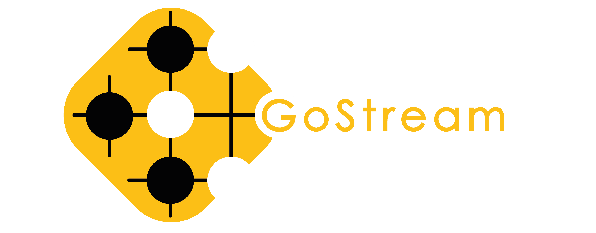
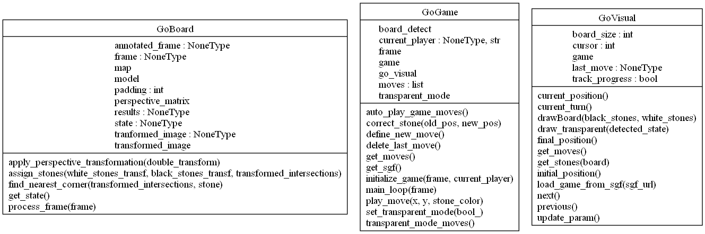

<div align="center">
    
    <h1>GOGAME DETECTION</h1>

<h3>Developed with the software and tools below</h3>
<p align="center">
    
    
    
    
    
</p>
</div>

---

## Table of Contents
- [Overview](#overview)
- [Important Modules](#modules)
- [Getting Started](#getting-started)
    - [Installation](#installation)
    - [Running GoGame-Detection](#running-gogame-detection)
- [Acknowledgments](#acknowledgments)


---


## 📍 Overview

This project is dedicated to the development of a program capable of recognizing a game board, its stones and their respective positions within a go game context from a video stream.
The primary problem that our project tackles is the detection of the game setup at different angles without the need to set the camera at a fixed configuration. This capability allows for flexibility in changing the camera's angle or position, as well as adjusting the game board's placement during the course of the game. This stands as a distinctive feature compared to many existing solutions. The solution is in the form of a simple web application developed with Flask.


Key Highlights:
- **Real-time board recognition:** Capable of detecting key components of a go game using a custom trained `Yolov8` model.
- **Board state:** Capable of accurately positioning white and black stones using post processing techniques.
- **Game management:** Capable of managing a game with or without respecting the Go game rules.
- **SGF:**  Capable of visually reproducing a game and saving an SGF file of the streamed game for later use. 
- **Intuitive Visualization:** An interactive user interface displaying the streamed game has been developed on the base of this project. The interface takes the form of a website.

---


## Demo
Game mode demo where playing have to be according to Go rules: 
[Game Mode](static/game_mode.mp4)

Free or transparent mode demo where one can place any stone anywhere anytime: 
[Free Mode](static/free_mode.mp4)


---


## ⚙️ Important Modules


| File                             | Summary                                                               |
| ---                              | ---                                                                   |
| requirements.txt                 | Dependencies for the project                                          |
| main.py                          | Main script to run GoGame-Detection                                   |
| GoGame.py                        | Class for game management                                             |
| GoVisual.py                      | Class for visual representation of the Go game                        |
| GoBoard.py                       | Class for detecting and managing the board in its current position    |
| model.pt                         | Trained deep learning model file                                      |

- **UML Diagramm:**
<div align="center">
    
</div>

- **Detection algorithm:**

  
| File                             | Summary                                                               |
| ---                                                                                                                                                                            | ---                                                                                             |
| [Algorithmic approach](https://github.com/GoGame-Recognition-Project/GoGame-Detection/blob/main/Notebooks_to_explain_detection/Algorithmic_approach_to_detect_a_go_board.ipynb)| Uses OpenCv and algorithmic techniques to detect keys components before post processing    |
| [Deep Learning approach](https://github.com/GoGame-Recognition-Project/GoGame-Detection/blob/main/Notebooks_to_explain_detection/Go_board_detection.ipynb)                     | Uses custom trained YoloV8 model to detect keys components before post processing               |

---

## 🚀 Getting Started

***Dependencies***

Please ensure you have the following dependencies installed on your system:

ℹ️ [opencv-python](https://pypi.org/project/opencv-python/) (version 4.8.1.78)

ℹ️ [scikit-learn](https://scikit-learn.org/stable/install.html) (version 1.3.2)

ℹ️ [sente](https://pypi.org/project/sente/) (version 0.4.2)

ℹ️ [ultralytics](https://pypi.org/project/ultralytics/) (version 8.0.231)

### 🔧 Installation

1. Clone the GoGame-Detection repository:
```sh
git clone https://github.com/GoGame-Recognition-Project/GoGame-Detection.git
```

2. Change to the project directory:
```sh
cd GoGame-Detection
```

3. Install the dependencies:
```sh
pip install -r requirements.txt
```


### 🤖 Running the script

```sh
python run.py
```

---


## 👏 Acknowledgments

- Special thanks to [Etienne Peillard](https://github.com/EPeillard) our tutor for this project and Nicolas Desdames the representative of Tenuki Club, our project client.

[**Return**](#Top)

---
